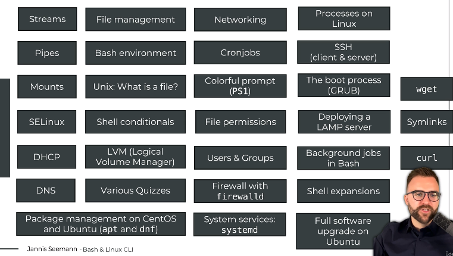

## 1. intro

* introducing himself : Jannis Seemann 
* topics we will learn : 
* 

### the structure : 
#### introduction 
* perpare 
* setting up the system 
#### part 2 : bash 
* using command line 
#### part 3 :linux : 
* understand concepts

#### part 4: advanced bash 
* automate 

### about this course 
* 