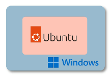

## 7. Installing VirtualBox

### how to run linux ? 
* the goal : create isolated linux environment

#### several ways 
* main operating system 
  * dual boot 
* for learning : 
  * virtualized (recommended) 
  * 

### virtual advantages :  
* reinstall easily 
* switch between different linux distro 
* share files 
* ...

#### if you are using Mac 
* intel processor : VirtualBox 
* apple processor : UTM 

### what is virtual box : 
* virtualization software allows to create and run virtual machine on the ocmputer 

### install virtaul box 
* download and go with default selections 

#### how to use virtualbox 
* 