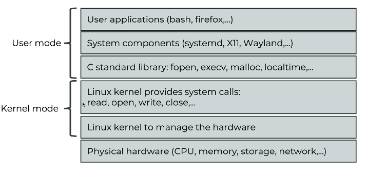

## 231. Bridging Hardware and Software: How does a Kernel work?

The **kernel** is the core of the operating system. It sits between **applications** (software) and **hardware** (CPU, RAM, disks, network cards, GPUs, etc.), and it decides **who can use what**, **when**, and **how**.

Think of Linux as having two main “worlds”:
- **User space**: your programs (bash, Firefox, Python, systemd utilities, etc.)
- **Kernel space**: the Linux kernel (trusted code that can directly control hardware)

User-space programs **cannot** directly access hardware. Instead they ask the kernel using **system calls** (syscalls), and the kernel performs the operation safely.

---

### key functions of kernel 
The kernel provides several critical services:

#### 1) Process management
- **Scheduling**: decides which process runs on the CPU next.
- **Resource allocation**: CPU time, priorities, limits.
- **Inter-Process Communication (IPC)**: lets processes communicate safely.

Examples:
- You run `sleep 10` and `vim file.txt` at the same time: the scheduler shares CPU between them.
- A web server like `nginx` spawns worker processes; the kernel schedules them across CPU cores.

Useful commands:
- `ps aux` (list processes)
- `top` / `htop` (live view)
- `nice -n 10 command` (run with lower priority)

#### 2) Memory management
- Manages **physical RAM** and **virtual memory**.
- Gives each process its own **virtual address space** (isolation + security).
- Handles allocation/deallocation, caching, and swapping.

Examples:
- Two programs can both use address `0x400000` in *their own* virtual memory without conflict.
- If RAM is tight, the kernel may swap some memory to disk (if swap exists).

Useful commands:
- `free -h`
- `vmstat 1`
- `cat /proc/meminfo | head`

#### 3) File system management
- Supports multiple file systems (e.g., **ext4**, **XFS**, **Btrfs**).
- Implements permissions, caching, and consistent read/write behavior.

Examples:
- `cat file.txt` triggers syscalls like `open()`, `read()`, `close()`.
- The kernel talks to the disk driver, reads blocks, and returns bytes to your program.

Useful commands:
- `df -h` (disk usage by filesystem)
- `lsblk` (block devices)
- `mount` (mounted filesystems)

#### 4) Networking stack
- Implements network protocols (Ethernet, IP, TCP/UDP, etc.).
- Handles routing, packet filtering, and traffic control.

Examples:
- `ping 8.8.8.8` uses ICMP; the kernel builds packets and sends them via the NIC driver.
- `curl https://example.com` uses TCP + TLS (TLS in user space, TCP in kernel space).

Useful commands:
- `ip a` (addresses)
- `ip r` (routes)
- `ss -tulpn` (list listening sockets)

#### 5) Device drivers / Hardware Abstraction
- The kernel provides common APIs and loads **drivers** to control hardware.
- This is what “bridges” software and hardware in practice.

Examples:
- Disk drivers (SATA/NVMe), network drivers (Intel/Broadcom), GPU drivers (NVIDIA/AMD).

---

### to find the kernel 
Common places to look:
- Kernel image in `/boot`: typically named something like `vmlinuz-<version>`
- Initial RAM disk in `/boot`: `initrd.img-<version>` or `initramfs-<version>.img`
- Kernel version currently running:
  - `uname -r`

Examples:
- List installed kernel images:
  - `ls -lh /boot/vmlinuz-*`
- Check what you are running right now:
  - `uname -r`

---

### what are kernel modules 
**Kernel modules** are pieces of kernel code that can be loaded/unloaded **on demand** (instead of being built into the kernel permanently).

Why modules are useful:
- Add support for new hardware without rebuilding the whole kernel
- Keep the base kernel smaller
- Load only what you need

Common module examples:
- **Device drivers**
  - NVIDIA GPU driver modules
  - Broadcom Wi‑Fi driver modules
- **VFIO** (Virtual Function I/O)
  - Used for PCI passthrough (e.g., giving a VM direct access to a GPU or NIC)
- **Filesystem modules**
  - ZFS (usually installed as an out-of-tree module on many distros)
- **Virtualization-related**
  - VirtualBox modules

Where modules live (for the running kernel):
- `/lib/modules/$(uname -r)/`

---

### how can we list the kernel modules in our system : 
List currently loaded modules:
- `lsmod`

Get details about a specific module:
- `modinfo <module_name>`

Load a module (and dependencies):
- `sudo modprobe <module_name>`

Unload a module:
- `sudo modprobe -r <module_name>`

Practical example:
- If your filesystem module isn’t loaded yet:
  - `sudo modprobe btrfs`
  - `lsmod | grep btrfs`

---

### sometimes you need install additional moduels 
Sometimes your distro does not ship a driver/module by default, or it must match your kernel version.

Typical examples:
- NVIDIA proprietary driver modules (installed from distro packages or vendor repo)
- VirtualBox modules (require headers and a build step on some distros)
- ZFS modules (often provided via separate repositories/packages)

Tip: when building external modules, you usually need kernel headers/devel packages:
- Debian/Ubuntu-like: `linux-headers-$(uname -r)`
- RHEL/CentOS/Fedora-like: `kernel-devel` (matching your kernel)

---

### “Locking” modules vs “locking” kernel updates (important!)
There are two different ideas people mix up:

1) **Prevent a module from loading** (blacklist it)
- This is done with `/etc/modprobe.d/*.conf`, not `apt-mark hold`.

Example (blacklist a module):
- Create a file like:
  - `/etc/modprobe.d/blacklist-example.conf`
  - Content: `blacklist nouveau`

Then rebuild initramfs (commonly needed so the change applies early in boot):
- Debian/Ubuntu: `sudo update-initramfs -u`
- RHEL/Fedora: `sudo dracut -f`

2) **Prevent kernel packages from updating** (hold/versionlock)
- This is about **packages** (kernel versions), not modules.

#### Hold kernel updates on Debian/Ubuntu (APT)
Hold a kernel meta-package (example names vary by distro):
- `sudo apt-mark hold linux-image-generic linux-headers-generic`

Unhold:
- `sudo apt-mark unhold linux-image-generic linux-headers-generic`

Note: Your system might use other kernel package names such as `linux-image-amd64`, `linux-generic-hwe-*`, etc.

#### Versionlock kernel updates on RHEL/CentOS/Fedora (DNF)
Lock kernel packages to avoid unexpected upgrades:
- `sudo dnf versionlock add kernel kernel-core kernel-modules kernel-modules-extra`

List locks:
- `sudo dnf versionlock list`

Remove a lock:
- `sudo dnf versionlock delete kernel`

---

### how do we communicate with the hardware?
The basic flow usually looks like this:
1) An application calls a function like `open()`, `read()`, `write()`, `socket()`, etc.
2) That triggers a **system call** into the kernel.
3) The kernel checks permissions, decides what to do, and talks to the correct **driver**.
4) The driver communicates with the hardware (often via interrupts + DMA).
5) The kernel returns the result back to the application.

Example: reading a file
- App runs `cat /etc/hosts`
- Kernel does: filesystem lookup → disk/NVMe driver reads blocks → returns bytes to `cat`

Example: sending a ping
- App runs `ping 1.1.1.1`
- Kernel does: build ICMP packet → route lookup → NIC driver sends frame → receives reply → delivers to ping

