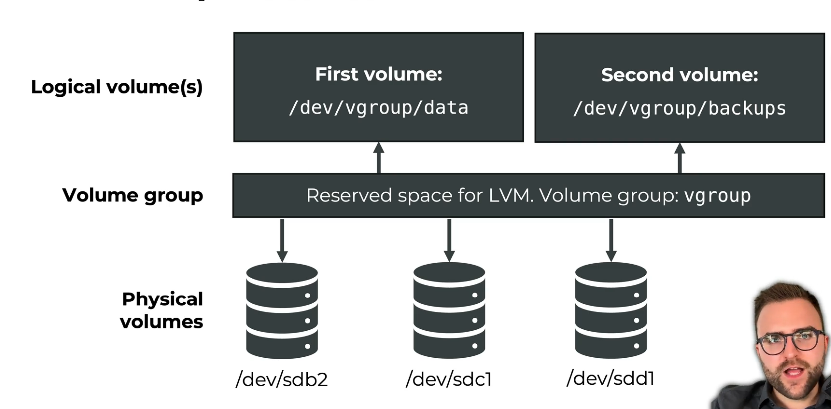

## 270. The Logical Volume Manager (LVM): Flexible Storage Management

### LVM : logical volume manager
* the idea
  * instead of placing our volume directly on disk 
  * we place a device mapper in between 
  * this allows us to combine the space from mutliple disks 
  * this space is then proviced as a "volume group" 
  * on top of this, we can create partitions 

#### the scheme 

