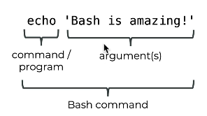
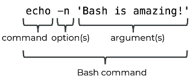

## 31. Outputting Text: the Command `echo`
* output text into the terminal 
* string should be wrapped in **single quotes** 

### the tasks : 
* write anything on the screen 
* use the commands in history 
* write without line break 
* write with character escape
* write using multiple options 

### the command echo : 

* by default : 
  * output line break at the end, disable -> -n 
  * exmaple : `echo -n "hello world"`

  * another option : -e , enable escape character
  * example : `echo -e "hello \n world"`

#### combine options 
* example : `echo -e -n "hello \n world"`
* or  : `echo -en "hello \n world"`